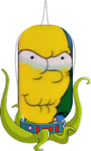

# Simpsons Space Invaders
Simple space invaders style game, using snippets from The Simpsons.  

> :warning: __Disclaimer:__ This was just to become familar with pygame and OOP, the simpsons references are for fun and educational purposes. I don't own any of images and sound snippets, or any of the material related to The Simpsons.  
***
# Table of Contents
- [Simpsons Space Invaders](#simpsons-space-invaders)
- [Table of Contents](#table-of-contents)
- [Setup](#setup)
- [Start the game](#start-the-game)
- [How to play](#how-to-play)
  - [Controls](#controls)
  - [Powerups](#powerups)
  - [Scores](#scores)

# Setup

> Prerequisite is to have python (>= 3.9) installed. 

## Windows

Using `cmd`, clone the repository and navigate into it, then setup the virtual environment: 

```
# First navigate to where you want the repo to go, then clone it
git clone https://github.com/fallonda/simpsons_space_invaders.git

# Navigate into the newly cloned repo
cd simpsons_space_invaders

# Setup the new virtual env
python -m venv .\env 

# Activate it (for Windows)
.\env\Scripts\activate

# Install the required packages to the new virtual environment
pip install -r requirements.txt

# Start the game
python simpsons_space_invaders\game.py

# Have fun! Let me know if you have any installation issues. 
```

## Linux

Using the terminal, clone the repository, navigate into it, then setup the virtual environment: 

```
# Navigate to the project
cd <path_to_project>

# Setup the new virtual env
python -m venv ./env

# Activate it (for Linux)
source ./env/Scripts/activate

# Install the required packages to the new virtual environment
pip install -r requirements.txt

# Start the game
./run_game.sh

# Have fun! Let me know if you have any installation issues. 
``` 

# How to play

Homer must use his trusty spaceship drone to fight off the invading Kang and Kodos. You must help homer shoot down the enemies, without letting them crash into the spaceship.  

## Controls

* `W` `A` `S` `D` to move the spaceship around the screen. 
* `left` and `right` to rotate the angle of the spaceship. 
* `up` to quickly face the spaceship upwards. 
* `down` to rotate the spaceship 180 degrees. 
* `spacebar` to fire bullets.  
* `Esc` will pause the game. 
* `Enter` will let Homer throw the pop rocks + cola bomb, when it is ARMED.  

## Powerups

Occasionally, powerup items will fall randomly. These include: 

* `Donut`: +20 health.
* `Beer`: +20 health.
* `Lemon`: This gives Homer the `Lemon gun` power, which transforms the bullets to lemons that can kill the enemies in one shot, and give 'em the 'ol lemon face.  

* [`Merciless Pepper of Quetzalacatenango`](https://simpsons.fandom.com/wiki/Guatemalan_Insanity_Pepper): Transports Homer to the astral plains, and lets you fire three fireballs at once.  
* `Pop rocks` and `Buzz cola`: When both these items have been collected, the [`cola-bomb`](https://youtu.be/gHxH3MJKU_E) is 'ARMED'. Press `Enter` to let Homer chuck it into the center of the screen. All on-screen enemies will explore. See you in hell, candy boys!  

## Scores

The top 5 high scores will be stored and can be viewed from the `high_scores` option in the main menu. Make sure you press `Enter` after you enter your username before playing for it to register in the scores.  

***

That's all there is too it! Enjoy and let me know if you have any suggestions for improvements, new enemies or feedback of any kind! :smile:

*** 


